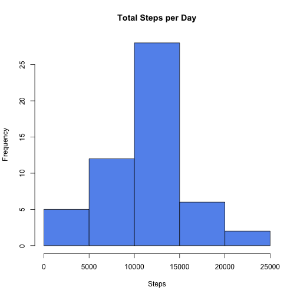
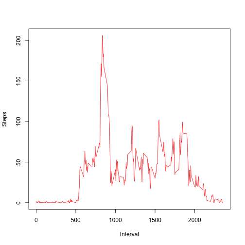
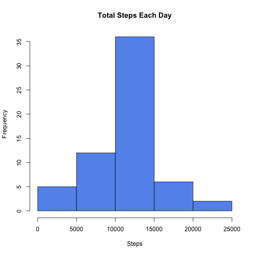
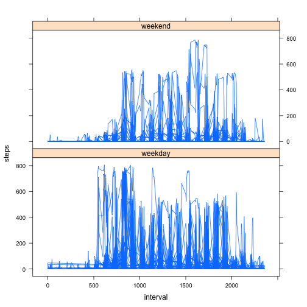

# Reproducible Research: Peer Assessment 1


  
  
## Loading and preprocessing the data  
_Load the data (i.e. read.csv())_  

```r
setwd("./Documents/Me/R")
```

```
## Error: cannot change working directory
```

```r
data = read.csv("activity.csv", na.string = "NA", colClasses = c("integer", 
    "Date", "integer"))
```

  
  
## What is mean total number of steps taken per day?  

_Make a histogram of the total number of steps taken each day_  


```r
x = aggregate(. ~ date, data = data[1:2], sum)
hist(x$step, col = "cornflowerblue", xlab = "Steps", main = "Total Steps per Day")
```

 

```r

xMean = mean(x$step)
xMedian = median(x$step)
```


_Calculate and report the mean and median total number of steps taken per day_  
__Mean:__ 1.0766 &times; 10<sup>4</sup>  
__Median:__ 10765
  
  
## What is the average daily activity pattern?  

_Make a time series plot (i.e. type = "l") of the 5-minute interval (x-axis) and the average number of steps taken, averaged across all days (y-axis)_  


```r
y = aggregate(. ~ interval, data = data, mean)
plot(y$interval, y$step, type = "l", xlab = "Interval", ylab = "Steps", col = "red")
```

 


_Which 5-minute interval, on average across all the days in the dataset, contains the maximum number of steps?_  


```r
maxSteps = y[which.max(y$step), 1:2]
```

__Interval with Maximum Number of Steps (interval, steps):__ 835, 206.1698
  
  
## Imputing missing values

_Calculate and report the total number of missing values in the dataset (i.e. the total number of rows with NAs)_  


```r
numNA = sum(is.na(data))
```

__Number of NA:__ 2304  

_Create a new dataset that is equal to the original dataset but with the missing data filled in._  


```r
dataInt = data
dataInt[is.na(dataInt)] = y$step
```


_Make a histogram of the total number of steps taken each day and Calculate and report the mean and median total number of steps taken per day._


```r
z = aggregate(. ~ date, data = dataInt[1:2], sum)
hist(z$step, col = "cornflowerblue", xlab = "Steps", main = "Total Steps Each Day")
```

 


_Do these values differ from the estimates from the first part of the assignment? What is the impact of imputing missing data on the estimates of the total daily number of steps?_

```r
zMean = mean(z$step)
zMedian = median(z$step)
```

__New Mean:__ 1.0766 &times; 10<sup>4</sup>  
__New Median:__ 1.0766 &times; 10<sup>4</sup>  
  
No, there is no difference between these estimates and the earlier ones made in the first part. 
  
  
## Are there differences in activity patterns between weekdays and weekends?

_Create a new factor variable in the dataset with two levels – “weekday” and “weekend” indicating whether a given date is a weekday or weekend day._  


```r
dataInt$weekday <- weekdays(dataInt$date)
weekend <- dataInt$weekday == "Saturday" | dataInt$weekday == "Sunday"
dataInt$weekday[weekend] <- "weekend"
dataInt$weekday[!weekend] <- "weekday"
```


_Make a panel plot containing a time series plot (i.e. type = "l") of the 5-minute interval (x-axis) and the average number of steps taken, averaged across all weekday days or weekend days (y-axis)._  


```r
require("lattice")
```

```
## Loading required package: lattice
```

```r
xyplot(steps ~ interval | weekday, data = dataInt, layout = c(1, 2), type = "l")
```

 

There is generally more activity (as measured by steps) later in the day (i.e., interval) on the weekend, while the reverse is true of weekdays - more activity earlier in the day.
